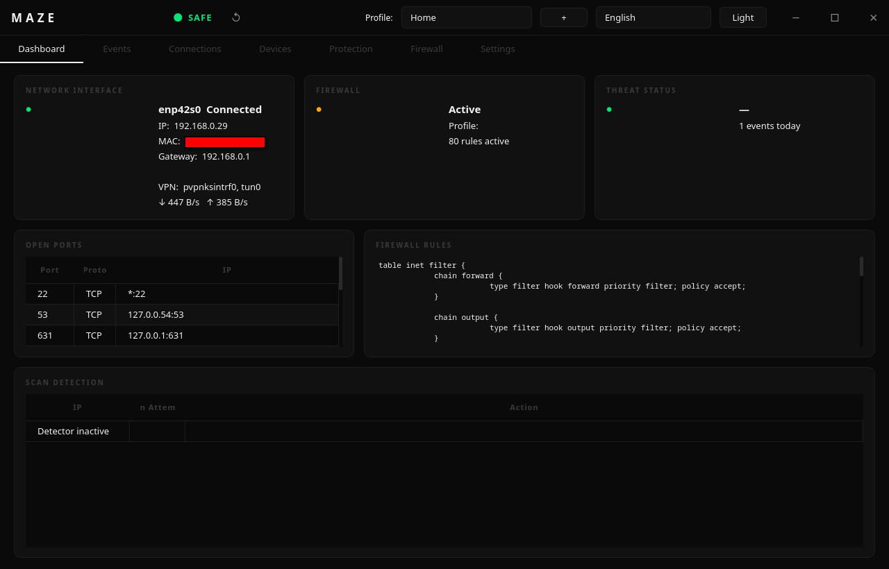
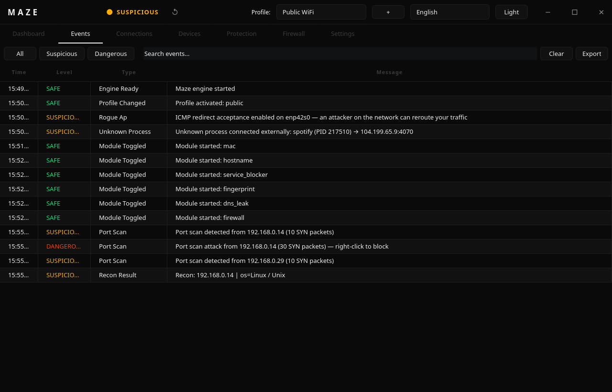

<div align="center">

# MAZE NETWORK

**Public WiFi Security Monitor**

*MITM detection · MAC randomization · nftables firewall · Packet analysis*

---



---

[](https://python.org)
[](https://pypi.org/project/PyQt6/)
[](https://kernel.org)
[](LICENSE)

</div>

---

## What is Maze Network?

Maze Network is a Linux desktop application that monitors your network in real time and alerts you to threats commonly found on public WiFi networks — coffee shops, airports, hotels. It detects active attacks (ARP spoofing, port scans, Evil Twin APs, DNS poisoning), manages a safe nftables firewall, and gives you one-click tools to block IPs and ports without breaking your internet connection.

The GUI runs as your normal user. A small privileged helper runs as a **systemd daemon** (root) that handles packet capture, firewall rules, and MAC address changes. Because the daemon is started by systemd, the GUI never needs your password — credential handling is removed entirely, which closes off the password-prompt privilege-escalation surface.

---

## Features

### Detection & Monitoring
| Module | What it detects |
|---|---|
| **ARP Watcher** | ARP spoofing, gateway MAC/IP changes |
| **Port Scan Detector** | TCP SYN floods from a single source |
| **DNS Validator** | DNS poisoning (cross-checks 3 DoH resolvers) |
| **DNS Leak Preventer** | Plaintext DNS queries escaping VPN tunnel |
| **TLS Monitor** | Certificate hash changes for canary hosts |
| **SSL Strip Detector** | HTTP downgrade attacks on known-HTTPS hosts |
| **Rogue AP Detector** | Evil Twin APs (BSSID changes), ICMP redirects |
| **Process Monitor** | Unknown processes making external connections |

### Protection
| Feature | Description |
|---|---|
| **nftables Firewall** | Named sets with `policy accept` — blocks only what you add, never breaks internet |
| **MAC Randomization** | Scheduled MAC address rotation via privileged helper |
| **Hostname Hiding** | Disables mDNS/Avahi to hide device hostname on LAN |
| **TCP Fingerprint** | Randomizes TTL and TCP window scaling via sysctl |
| **Service Blocker** | Closes listening services on untrusted networks |

### Interface
- **Dashboard** — Live network info, firewall status, threat level, bandwidth monitor (↓/↑ per second), port scan table
- **Events** — Filterable event log (All / Suspicious / Dangerous), text search, CSV export
- **Firewall** — Add/remove blocked IPs and ports with instant feedback
- **Devices** — All discovered LAN devices with MAC addresses
- **Connections** — Live process→IP connection map
- **Protection** — Per-module toggle switches
- **Settings** — Threshold tuning, process whitelist, IP whitelist, autostart toggle

### Other
- **IP Reconnaissance** — Auto-triggered on dangerous events: reverse DNS, open port scan, OS fingerprint via TTL
- **Custom Profiles** — Create named security profiles with per-feature toggles
- **Persistent Log** — All events written to `~/.config/maze/maze.log` (rotating, 2 MB × 3)
- **System Tray** — Starts hidden in the tray on login (autostart); click the tray icon to show the window; desktop notifications for dangerous events
- **Session Summary** — Event count breakdown shown on quit
- **English + Turkish** UI with live language switching

---

## Architecture

```
┌──────────────────────────────────────────────┐
│  GUI Process  (normal user, no password)     │
│                                              │
│  PyQt6 + qasync  ──►  MazeEngine            │
│                           │                  │
│                    HelperClient              │
│                           │  Unix socket     │
└───────────────────────────┼──────────────────┘
              /run/maze/maze.sock (root:maze 0660)
┌───────────────────────────┼──────────────────┐
│  Helper Daemon (root, systemd: maze.service) │
│                           ▼                  │
│   scapy (ARP/SYN sniff)  ─────► push events │
│   nft (firewall rules)                       │
│   ip link (MAC change)                       │
│   sysctl (TCP fingerprint)                   │
└──────────────────────────────────────────────┘
```

The helper runs as a systemd service and publishes a Unix socket at `/run/maze/maze.sock`, owned `root:maze` with mode `0660`. Only members of the `maze` group can reach it — enforced both by file permissions and an in-process `SO_PEERCRED` group-membership check. All nft operations go through an allowlist (`add`, `delete`, `list`, `flush`, `get`). Input is validated with strict regex before any subprocess call.

---

## Requirements

- **OS:** Linux (kernel 4.x+, any distribution)
- **Python:** 3.11 or newer
- **System tools:** `nftables`, `iproute2`, `dbus`
- **Optional:** `wireless-tools` (WiFi SSID/BSSID detection), `imagemagick` (icon resizing)

---

## Installation

### Arch Linux (AUR)

```bash
# with paru
paru -S maze

# with yay
yay -S maze
```

The AUR package installs Maze Network to `/opt/maze` and creates an isolated Python venv at `/opt/maze/venv` — no system Python packages are modified.

---

### Any Linux distribution (install script)

```bash
git clone https://github.com/USERNAME/maze.git
cd maze

# System-wide install to /opt/maze  (requires root)
sudo ./install.sh

# Per-user install to ~/.local  (no root needed)
./install.sh --user
```

The script detects your distribution and installs system dependencies automatically (Arch, Debian/Ubuntu, Fedora, RHEL, openSUSE and derivatives).

After install, launch from your application menu or run:

```bash
maze
```

To uninstall:

```bash
sudo /opt/maze/uninstall.sh
```

---

### From source (development)

```bash
git clone https://github.com/USERNAME/maze.git
cd maze

python3 -m venv venv
source venv/bin/activate
pip install -r requirements.txt

python main.py
```

---

## First Launch

Maze Network **never asks for a password**. A system install registers the privileged helper as a systemd service (`maze.service`) that starts at boot, and the GUI simply connects to it over `/run/maze/maze.sock`.

A `maze` group gates access to that socket, and your user is added to it during install. **Log out and back in once** (or run `newgrp maze`) so your desktop session picks up the new group membership — until then the GUI runs in limited (detection-only) mode.

The GUI always runs as your normal user; only the helper runs as root. If the daemon is not running for any reason, the GUI degrades gracefully to limited mode instead of prompting.

### Running from a source checkout

If you cloned the repo and want the daemon without a full `/opt` install:

```bash
sudo ./scripts/setup-daemon.sh        # install + enable maze.service, add you to 'maze'
# ... and to remove it:
sudo ./scripts/setup-daemon.sh --uninstall
```

---

## Usage

### Profiles

Select a security profile from the top bar:

| Profile | Modules active |
|---|---|
| **Home** | ARP watch, DNS validation, TLS monitoring |
| **Public** | All detection modules + port scan detector |
| **Paranoid** | All modules + process monitor + fingerprint protection |
| **Manual** | Nothing started — you control each module individually |

You can also create **custom profiles** with the **`+`** button next to the profile selector.

### Blocking IPs and ports

**Right-click** any event in the Events tab or any row in the Dashboard scan table to block the source IP. In the Firewall tab you can add arbitrary IPs/CIDRs and port numbers with TCP/UDP/Both selectors.

All rules use nftables named sets with `policy accept` — the firewall only drops what you explicitly add and never affects outbound traffic.

### Exporting events

In the **Events** tab, click **Export** to save the currently visible events (respecting active filters) to a CSV file.

### Autostart

The installer adds an autostart entry (`maze.desktop` with `Exec=maze --background`) so Maze Network launches **hidden in the system tray** on every login — the detection engine starts in the background without opening a window. Click the tray icon to show the dashboard; closing the window minimizes it back to the tray. System installs write `/etc/xdg/autostart/maze.desktop`; user installs write `~/.config/autostart/maze.desktop`.

---

## Configuration

Config is stored at `~/.config/maze/config.json` and is updated automatically when you change settings in the UI.

```json
{
  "interface": "enp42s0",
  "theme": "dark",
  "language": "en",
  "port_scan_threshold": 10,
  "mac_rotation_minutes": 30,
  "known_processes": ["firefox", "brave", "curl", "..."],
  "whitelist_ips": [],
  "custom_profiles": []
}
```

| Key | Description |
|---|---|
| `interface` | Network interface to monitor (auto-detected if missing or down) |
| `port_scan_threshold` | SYN packets from one IP before a SUSPICIOUS alert fires |
| `mac_rotation_minutes` | How often MAC address rotates when MAC randomization is active |
| `known_processes` | Processes that will never trigger "unknown process" alerts |
| `whitelist_ips` | IPs ignored by all detectors (gateway, trusted servers, etc.) |
| `custom_profiles` | User-defined profiles saved from the `+` dialog |

---

## Event levels

| Level | Color | Meaning |
|---|---|---|
| **Safe** | Green | Informational — new device seen, profile changed |
| **Suspicious** | Orange | Possible threat — DNS disagreement, port scan started, DNS leak |
| **Dangerous** | Red | Active attack — ARP spoofing, gateway MAC change, port scan escalation |

Dangerous events trigger a **desktop notification** via the system tray and automatically kick off **IP reconnaissance** (reverse DNS + port scan + OS fingerprint) on the attacker's IP.

---

## Security model

- **No password in the GUI, no polkit, no setcap, no SUID bit.** The privileged helper runs as a systemd-managed root daemon; the GUI only talks to it over a Unix socket. The GUI never handles credentials, so a malicious app cannot phish a sudo password through it, and a compromised GUI process cannot escalate beyond what the helper exposes.
- **Helper allowlist.** Only six nft operations are permitted (`add`, `delete`, `list`, `flush`, `get`). Every input (MAC, IP, interface name, table name, sysctl key) is validated with strict regex before reaching any subprocess call.
- **Group-gated socket + peer verification.** The socket is `root:maze` mode `0660`, so only `maze`-group members can open it, and the helper additionally re-checks each caller's group membership via `SO_PEERCRED`. Arbitrary local processes cannot send commands.
- **`policy accept` firewall.** Maze Network's nftables table never drops traffic globally. It only drops explicitly blocked IPs/ports. Deleting the table restores the original state instantly.
- **No auto-blocking.** Detection modules never automatically block traffic. All blocking is user-initiated (right-click, Firewall tab). The philosophy: alert and inform, never silently cut connections.

---

## Project structure

```
maze/
├── core/
│   ├── engine.py          # Module orchestration, event bus, recon trigger
│   ├── events.py          # Event types, threat levels
│   └── profile.py         # Built-in profile definitions
├── detection/
│   ├── arp_watch.py       # ARP spoofing + gateway change detection
│   ├── dns_validator.py   # DoH cross-validation (canary domains)
│   ├── rogue_ap.py        # Evil Twin + ICMP redirect check
│   ├── ssl_strip.py       # SSL strip detection
│   └── tls_monitor.py     # TLS cert hash monitoring (canary hosts)
├── protection/
│   ├── dns_leak.py        # Plaintext DNS leak detector
│   ├── firewall.py        # nftables named-set manager
│   ├── port_scanner.py    # TCP SYN flood detector
│   └── process_map.py     # Unknown process connection monitor
├── stealth/
│   ├── fingerprint.py     # TCP fingerprint obfuscation (sysctl via helper)
│   ├── hostname_hide.py   # mDNS/Avahi disable
│   ├── mac_changer.py     # Scheduled MAC randomization
│   └── service_blocker.py # Close listening services
├── gui/
│   ├── dashboard.py       # Main window, tray, session summary
│   ├── privilege.py       # Connect to the helper daemon (no password)
│   └── widgets/
│       ├── dashboard_view.py   # Cards, bandwidth monitor, scan table
│       ├── event_list.py       # Filterable event log + CSV export
│       ├── firewall_view.py    # IP/port block manager
│       ├── settings_view.py    # Thresholds, whitelist, autostart
│       └── profile_dialog.py  # Custom profile creator
├── utils/
│   ├── config.py          # Config load/save, CustomProfileConfig
│   ├── logger.py          # Rotating file + console logger
│   ├── network_info.py    # Interface info, firewall status
│   └── recon.py           # Passive IP reconnaissance
├── helper.py              # Privileged daemon (runs as root via systemd)
└── helper_client.py       # Async client for the helper socket
```

---

## License

GPL3 — see [LICENSE](LICENSE).

---

<div align="center">
<sub>Built for Linux · Tested on Arch Linux · PyQt6 + qasync + scapy</sub>
</div>
